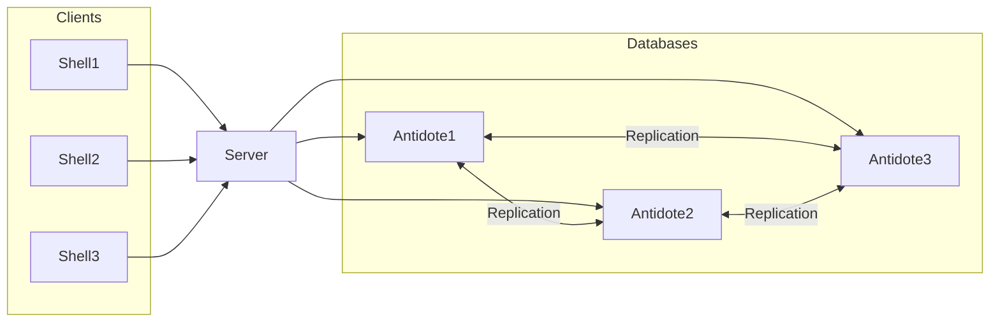

# AntidoteDB Java Tutorial

A demonstrative web shell that use [AntidoteDB][AntidoteDB-website] as backend database.

## What you need
* [Docker](https://docs.docker.com/engine/installation/)
* [docker-compose](https://docs.docker.com/compose/install/)
* An IDE for Javascript development

## Clone source code
git clone https://github.com/JPugetGil/antidote-web-shell

## Getting started
Requirements: [node.js][nodejs], [npm][npm], [Antidote][antidote-setup].  
To build it: `make` (or `npm install`).  
To run it with a local cluster of Docker containers: `make run`.  

To start a local Docker deployment of AntidoteDB (running three instances of Antidote): `docker-compose -f docker/docker-antidote-3dcs.yml up`.
To run the web server (which will listen on `localhost:3000`): `DEBUG=antidote-web-shell:* npm start`.  

It uses the AntidoteDB configuration specified in `config.js`.

| Note: make sure you have the software requirements listed above before following next steps. |
| --- 

### Step 1 : Starting antidote nodes
The following script installs the dependencies.
```bash
# in root directory
make
# if you don't have make installed
npm install
```

### Step 2 : Starting the application
The following script starts:
- three antidote docker containers and set up the inter-dc replication.
- the antidote-web-shell application available at : http://localhost:3000. This is a web shell that allows you to interact with the antidote database (the place where you write commands).
```bash
# in root directory
make run
# if you don't have make installed
docker-compose -f docker/docker-antidote-3dcs.yml up -d
npm start
```
We have now deployed this configuration:



### Step 3 : Try the following app commands
With this application, you can:
- Get, Increment or decrement a given counter.
- List elements, Add or remove an element in a given set of elements.

Some features are already implemented in the app, lets try them:
~~~~
- add-wins set:
    set add <set_id> <value>
    set remove <set_id> <value>
    set get <set_id>
- counter:
    count inc <counter_id>
    count dec <counter_id>
    count get <counter_id> 
~~~~

You can also try to disconnect Antidote servers to simulate network partitions (click on "Create partition"), commit some concurrent updates, then reconnect to merge CRDTs (click on "Heal partition").

### Step 4 : Hands On!!!
We now want to build our Task management app. Users would like to:
- To have several lists of tasks (their name designates their theme),
- For each list, we have as many tasks as we want.

A task contains :
- **A title** that will be considered unique in this list,
- **A short description** (< 120 characters),
- **A priority** ('low', 'medium', 'high'),
- **A deadline** (https://developer.mozilla.org/en-US/docs/Web/JavaScript/Reference/Global_Objects/Date).

Use the provided code as a starting point and edit the [server file](app.js) and [client file](public/js/script-tasks.js) to implement the features below:
* Add a new command `tasks add` that takes a list name, a task name (unique), a task description, a priority **['low', 'medium', 'high']** and a deadline as arguments and creates a new task object in the database.
* Add a new command `tasks get` that takes a list name and a task name as argument and prints the task information.
* Add a new command `tasks remove` that takes a list name and a task name as argument and deletes the task object from the database.
* Add a new command `tasks list` that takes a list name as argument and prints all the tasks in the list.

The task manager client is available at : http://localhost:3000/tasks

### Resources:
Some useful references:
* [API](API.md)
* [Antidote API ts](https://antidotedb.github.io/antidote_ts_client/)
* [AntidoteDB source code](https://github.com/AntidoteDB/antidote)
* [AntidoteDB Documentation](https://antidotedb.gitbook.io/documentation/)
* [Antidote Docker reference](https://github.com/AntidoteDB/docker-antidote/blob/master/README.md)

## Credits

[RainbowFS][rainbowfs] and [LightKone][lightkone] research projects.

 [antidote]: https://www.antidotedb.eu/
 [rainbowfs]: http://rainbowfs.lip6.fr/
 [lightkone]: https://www.lightkone.eu/
 [nodejs]: https://nodejs.org/
 [npm]: https://www.npmjs.com/
 [antidote-setup]: https://antidotedb.gitbook.io/documentation/overview/installation

